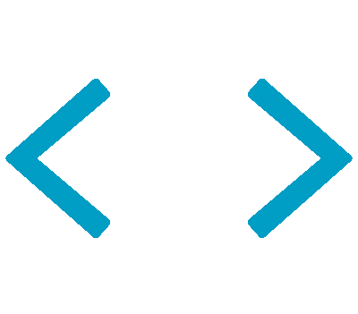

<!-- Intro  -->
<h3 align="center">
        <samp>&gt; Hey There!, I am
                <b><a target="_blank" href="https://www.linkedin.com/in/jyanez27">Joaquin Yañez</a></b>
        </samp>
</h3>

 
  <samp>
    <a href="mailto:joaquin.ayanezm@gmail.com">「 Email Me 」</a>
     
    「 I am a full stack web application developer from <b>Venezuela</b> 」
     
     
  </samp>

 
  

 

<!-- About Section -->

##  **About me**

 
  
 ❤️ &emsp; Love to writing code and learning new technologies  
 📧 &emsp; Reach me anytime: joaquin.ayanezm@gmail.com  
 💬 &emsp; Ask me about anything [here](https://github.com/chronopio/chronopio/issues)

 
 
 
 

##  **Used to code**

 

##  **Top Projects -**

  

 

 

  

<a> 
    
   
</a>
